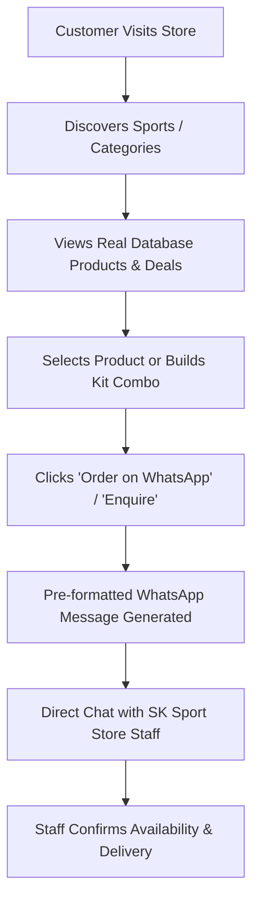

# SK SPORT STORE — COMPLETE APPLICATION DOCUMENTATION

Welcome to the **SK Sport Store** application documentation. This guide provides a full overview of the website's architecture, business model, homepage sections, database schema, administrative portal, and setup procedures.

---

## 1. Business Model & Ordering Workflow

**SK Sport Store** is a sports retail store specializing in equipment, footwear, apparel, and accessories across 8+ sports (Cricket, Football, Badminton, Tennis, Basketball, Running, Fitness, etc.).

### WhatsApp-First Ecommerce

Unlike standard ecommerce websites with integrated payment gateways and automatic checkouts, SK Sport Store operates on a **WhatsApp-Direct Ordering Model**:

- Customers browse the rich, modern product catalog online.
- Customers can filter by sport, brand, need, or price budget.
- Orders and product inquiries are pre-filled and sent directly to the store owner's **WhatsApp**.
- Store staff confirms product stock, sizing, local delivery, and payment options directly on WhatsApp with the customer.



---

## 2. Homepage Architecture (15 Sequential Sections)

The redesigned homepage is built with a dark athletic theme, high-contrast lime green accents (`oklch(0.88 0.21 122)`), condensed sports typography, and micro-animations.

| #      | Section Name               | Component Path                                                                                                                | Description & Features                                                                                                                                                          |
| ------ | -------------------------- | ----------------------------------------------------------------------------------------------------------------------------- | ------------------------------------------------------------------------------------------------------------------------------------------------------------------------------- |
| **01** | **Announcement Bar**       | `src/components/layout/AnnouncementBar.tsx`                                                                                   | Slim header bar: `DIRECT WHATSAPP ORDERS • LOCAL DELIVERY AVAILABLE • GENUINE SPORTS GEAR • NO ONLINE PAYMENT REQUIRED`.                                                        |
| **02** | **Header & Navigation**    | `src/components/layout/Header.tsx`<br>`src/components/navigation/DesktopNav.tsx`<br>`src/components/navigation/MobileNav.tsx` | Sticky navbar with `SK SPORT STORE` logo, search bar, sports dropdown menu (8 core sports), hot deals link, quick WhatsApp button, and enquiry badge. Mobile responsive drawer. |
| **03** | **Hero Section**           | `src/components/home/HeroSection.tsx`                                                                                         | Impactful headline `PLAY HARD. PLAY BETTER.`, subtext, dual CTAs (`SHOP NOW` & `CHAT ON WHATSAPP`), and right-hand sports showcase visual.                                      |
| **04** | **Trust / Benefits Strip** | `src/components/home/BenefitStrip.tsx`                                                                                        | 4 verified pillars: `QUALITY SPORTS GEAR`, `BEST VALUE`, `WHATSAPP ORDERING`, `EASY SUPPORT`.                                                                                   |
| **05** | **Shop by Sport**          | `src/components/home/ShopBySport.tsx`                                                                                         | 8 sport cards (Cricket, Football, Badminton, Tennis, Basketball, Running, Fitness, Sports Shoes) with equipment snippet lists and hover zoom effects.                           |
| **06** | **Best Sellers**           | `src/components/home/BestSellers.tsx`                                                                                         | 4 popular products from DB with discount percentages (`-22%`), brand tags, stock status (`✓ IN STOCK`), and direct `ORDER ON WHATSAPP` buttons.                                 |
| **07** | **Shop by Need**           | `src/components/home/ShopByNeed.tsx`                                                                                          | 4 tailored collections: _Cricket Essentials_, _Football Training_, _Running Gear_, _Home Fitness_.                                                                              |
| **08** | **Deals of the Week**      | `src/components/home/DealsSection.tsx`                                                                                        | Promotional discount showcase highlighting discounted products with original vs sale pricing.                                                                                   |
| **09** | **Shop by Budget**         | `src/components/home/ShopByBudget.tsx`                                                                                        | 4 price tiers (`Under ₹999`, `₹999 – ₹2,499`, `₹2,499 – ₹4,999`, `₹5,000+`) linking to filtered catalog views.                                                                  |
| **10** | **New Arrivals**           | `src/components/home/NewArrivals.tsx`                                                                                         | Recently added sports equipment with direct WhatsApp order links + `VIEW ALL NEW →`.                                                                                            |
| **11** | **Shop by Brand**          | `src/components/home/ShopByBrand.tsx`                                                                                         | Dynamically extracted brand badges from the database (`SK Pro`, `Featherline`, `Strikeline`, `Baseline`, `Rimline`, `Pacer`, `IronCore`).                                       |
| **12** | **Build Your Kit**         | `src/components/home/KitBuilder.tsx`                                                                                          | Interactive sport kit combo builder (Cricket, Football, Badminton, Fitness, Running) with subtotal and WhatsApp package inquiry.                                                |
| **13** | **Why SK Sport Store**     | `src/components/home/WhyChooseUs.tsx`                                                                                         | 4 genuine store trust pillars.                                                                                                                                                  |
| **14** | **WhatsApp CTA**           | `src/components/home/WhatsAppCtaSection.tsx`                                                                                  | Consultation banner: `NOT SURE WHAT TO BUY?` with direct store chat & call options.                                                                                             |
| **15** | **Footer**                 | `src/components/layout/Footer.tsx`                                                                                            | Refined category navigation, customer help, store location, phone, email, and opening hours.                                                                                    |
| **—**  | **Floating WhatsApp CTA**  | `src/components/layout/FloatingWhatsApp.tsx`                                                                                  | Persistent desktop floating pill + mobile bottom action bar.                                                                                                                    |

---

## 3. Technology Stack & Project Structure

- **Framework**: React 19 + TypeScript + Vite
- **Routing**: TanStack Router (File-based, type-safe routes)
- **Data Fetching**: TanStack Query (React Query)
- **Styling**: Tailwind CSS + Custom CSS Variables in `src/styles.css`
- **Icons**: Lucide React
- **Backend & Database**: Supabase (PostgreSQL, Storage, Auth)

### Directory Structure

```text
src/
├── api/                  # API abstraction layer
│   ├── productsApi.ts
│   ├── categoriesApi.ts
│   └── adminApi.ts
├── components/           # Reusable UI components
│   ├── common/           # Button, Input, Section, States
│   ├── home/             # All 12 homepage section components
│   ├── layout/           # Header, Footer, AnnouncementBar, FloatingWhatsApp
│   ├── navigation/       # DesktopNav, MobileNav, SearchBar
│   ├── product/          # ProductCard, CategoryCard
│   └── ui/               # Radix / Shadcn primitives
├── config/
│   └── config.ts         # Store name, phone, WhatsApp number, announcements
├── db/                   # Universal database adapter layer
│   ├── database.ts
│   ├── types.ts
│   └── adapters/
│       ├── DatabaseAdapter.ts
│       └── SupabaseDatabaseAdapter.ts
├── routes/               # TanStack Router pages
│   ├── __root.tsx        # Root layout (Mounts Header, Footer, Floating CTA)
│   ├── index.tsx         # Redesigned Homepage
│   ├── products.tsx      # All Products shop & filters
│   ├── category.$slug.tsx# Category detail view
│   ├── product.$slug.tsx # Single product view
│   ├── auth.tsx          # Staff login with password preview
│   └── _authenticated/
│       └── admin.tsx     # Staff Catalog Admin Manager
└── services/             # Business logic layer
    ├── productService.ts
    ├── categoryService.ts
    ├── cartService.ts
    ├── storageService.ts
    └── whatsappService.ts # Pre-formatted WhatsApp link generator
```

---

## 4. Database Schema & Supabase Setup

The database schema uses PostgreSQL with Row Level Security (RLS) enabled.

### Tables

1. **`public.categories`**: Stores all sport categories (`name`, `slug`, `description`, `image_url`, `is_active`, `sort_order`).
2. **`public.products`**: Stores catalog items (`name`, `slug`, `sku`, `price`, `compare_at_price`, `image_url`, `size`, `brand`, `sport`, `gender`, `material`, `stock_status`, `is_featured`, `is_active`).
3. **`public.user_roles`**: User roles (`admin`, `moderator`, `user`) linked to Supabase Auth.
4. **`storage.buckets ('product-images')`**: Public bucket for product photo uploads.

### Full SQL Setup Script

Run this script in your **Supabase SQL Editor** to create all tables, indexes, RLS policies, and seed data:

```sql
-- 1. EXTENSIONS & ENUMS
CREATE EXTENSION IF NOT EXISTS "pgcrypto";
DO $$ BEGIN
  CREATE TYPE public.app_role AS ENUM ('admin', 'moderator', 'user');
EXCEPTION
  WHEN duplicate_object THEN null;
END $$;

-- 2. TABLES
CREATE TABLE IF NOT EXISTS public.categories (
  id UUID NOT NULL DEFAULT gen_random_uuid() PRIMARY KEY,
  name TEXT NOT NULL,
  slug TEXT NOT NULL UNIQUE,
  description TEXT,
  image_url TEXT,
  is_active BOOLEAN NOT NULL DEFAULT true,
  sort_order INTEGER NOT NULL DEFAULT 0,
  created_at TIMESTAMPTZ NOT NULL DEFAULT now(),
  updated_at TIMESTAMPTZ NOT NULL DEFAULT now()
);

CREATE TABLE IF NOT EXISTS public.products (
  id UUID NOT NULL DEFAULT gen_random_uuid() PRIMARY KEY,
  category_id UUID REFERENCES public.categories(id) ON DELETE SET NULL,
  name TEXT NOT NULL,
  slug TEXT NOT NULL UNIQUE,
  sku TEXT NOT NULL UNIQUE,
  description TEXT,
  short_description TEXT,
  price NUMERIC(10,2) NOT NULL DEFAULT 0,
  compare_at_price NUMERIC(10,2),
  image_url TEXT,
  size TEXT,
  brand TEXT,
  sport TEXT,
  gender TEXT,
  material TEXT,
  stock_status TEXT NOT NULL DEFAULT 'in_stock',
  is_featured BOOLEAN NOT NULL DEFAULT false,
  is_active BOOLEAN NOT NULL DEFAULT true,
  sort_order INTEGER NOT NULL DEFAULT 0,
  created_at TIMESTAMPTZ NOT NULL DEFAULT now(),
  updated_at TIMESTAMPTZ NOT NULL DEFAULT now()
);

-- 3. INDEXES
CREATE INDEX IF NOT EXISTS idx_products_category ON public.products(category_id);
CREATE INDEX IF NOT EXISTS idx_products_active ON public.products(is_active);
CREATE INDEX IF NOT EXISTS idx_products_featured ON public.products(is_featured);
CREATE INDEX IF NOT EXISTS idx_products_sport ON public.products(sport);
CREATE INDEX IF NOT EXISTS idx_products_brand ON public.products(brand);

-- 4. RLS POLICIES
ALTER TABLE public.categories ENABLE ROW LEVEL SECURITY;
ALTER TABLE public.products ENABLE ROW LEVEL SECURITY;

-- Public can view active catalog items
CREATE POLICY "Active categories are publicly viewable"
  ON public.categories FOR SELECT TO anon, authenticated USING (is_active = true);

CREATE POLICY "Active products are publicly viewable"
  ON public.products FOR SELECT TO anon, authenticated USING (is_active = true);

-- Logged-in staff can manage all products and categories
CREATE POLICY "Staff can manage products"
  ON public.products FOR ALL TO authenticated USING (true) WITH CHECK (true);

CREATE POLICY "Staff can manage categories"
  ON public.categories FOR ALL TO authenticated USING (true) WITH CHECK (true);

-- 5. STORAGE BUCKET
INSERT INTO storage.buckets (id, name, public)
VALUES ('product-images', 'product-images', true)
ON CONFLICT (id) DO UPDATE SET public = true;

CREATE POLICY "Product images are publicly viewable"
  ON storage.objects FOR SELECT TO public USING (bucket_id = 'product-images');

CREATE POLICY "Staff can upload product images"
  ON storage.objects FOR INSERT TO authenticated WITH CHECK (bucket_id = 'product-images');

CREATE POLICY "Staff can manage product images"
  ON storage.objects FOR ALL TO authenticated USING (bucket_id = 'product-images');
```

---

## 5. Staff / Catalog Admin Panel

### How to Access Admin

1. Open [`/auth`](http://localhost:8080/auth).
2. Enter your email and password. Click the **Eye Icon** to preview/verify password characters.
3. Upon signing in, you will be redirected to the **Catalog Admin** at [`/admin`](http://localhost:8080/admin).

### Admin Features

- **Brand Management ("EQUIPMENT BRANDS")**: Dedicated Admin tab to add, edit, search, and delete official equipment brands (e.g. `SK Pro`, `SS`, `SG`, `Kookaburra`, `MRF`, `Yonex`, `Cosco`, `Nivia`, `Nike`, `Adidas`, `Puma`). Displays real-time catalog product counts for each brand.
- **Managed Brand Selector in Product Form**: When adding/editing products, admins can 1-tap select from store brands or use quick brand chips, ensuring consistent brand metadata across all products.
- **Percentage Offer Calculator (% OFF)**: Live discount calculator with quick presets (`10%`, `20%`, `25%`, `30%`, `50%`, `70%`), showing exact customer savings amount in rupees.
- **Best Sellers & Quick-Slots ("POPULAR EQUIPMENT")**: Customizable 4-slot carousel with 1-tap product assignment and mobile touch cards.
- **Kit Builder Admin ("Cricket & Sports Kits")**: Interactive bundle manager for creating customized matchday gear packages.
- **Multi-Photo Upload (Up to 6 Photos)**: Upload up to 6 high-resolution product photos directly to Supabase Storage with instant previews, `#1 Primary` cover badge, set-as-primary button, and deletion controls.
- **Direct WhatsApp Orders**: All product cards and cart checkouts format pre-filled WhatsApp messages with Product ID / SKU, Name, Quantity, Unit Price, and Total Cart Price for instant 1-tap DM orders.

---

## 6. Store Configuration

You can customize the store's contact information, WhatsApp number, and address in [`src/config/config.ts`](file:///c:/Users/ljashwin/OneDrive/Documents/skstore/play-order-chat/src/config/config.ts):

```typescript
export const config = {
  store: {
    name: "SK Sport Store",
    tagline: "Sports equipment, footwear, apparel and accessories",
    whatsappNumber: "917338882551", // WhatsApp phone number with country code
    phone: "+91 7338882551",
    email: "hello@sksportstore.com",
    address: "SK Sport Store, Main Market Road",
    openingHours: "Mon – Sat: 9:00 AM – 9:00 PM | Sun: 10:00 AM – 6:00 PM",
  },
  // ...
};
```

---

## 7. Running Locally

1. **Install Dependencies**:

   ```bash
   npm install
   ```

2. **Set Environment Variables (`.env`)**:

   ```env
   VITE_SUPABASE_PROJECT_ID="kjiuolhmcgfkyvwefskg"
   VITE_SUPABASE_PUBLISHABLE_KEY="eyJhbGci..."
   VITE_SUPABASE_URL="https://kjiuolhmcgfkyvwefskg.supabase.co"
   ```

3. **Start Development Server**:
   ```bash
   npm run dev
   ```
   Open [`http://localhost:8080`](http://localhost:8080) in your browser.
